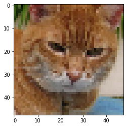
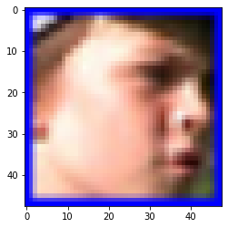
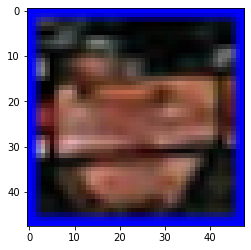
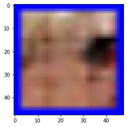

# Facial Emotion Detection

## Introduction
Created an realtime emotion detection application which detects 7 different types of emotions using facial expressions detected from the live camera as well as the images using FER2013 dataset.
Developed a model using convolutional neural network and used that model to label the emotions after extracting and editing the faces from the COCO dataset 

<h2> Import Libraries</h2>


```python
import matplotlib
import numpy as np
import matplotlib.pyplot as plt
import cv2
import sys
import os
import random
import pandas as pd
import tensorflow as tf
from keras.preprocessing import image
from keras.preprocessing.image import img_to_array
from keras.preprocessing.image import load_img
from keras.preprocessing.image import array_to_img
from skimage.transform import resize
from PIL import Image
import sys, os
import pandas as pd
import numpy as np

from keras.models import Sequential
from keras.layers import Dense, Dropout, Activation, Flatten
from keras.layers import Conv2D, MaxPooling2D, BatchNormalization,AveragePooling2D
from keras.losses import categorical_crossentropy
from keras.optimizers import Adam
from keras.regularizers import l2
from keras.utils import np_utils
import os
import cv2
import numpy as np
import csv
from keras.models import model_from_json

```


```python
data = pd.read_csv('C:/UTA/Machine Learning/Project/Dataset/archive/fer2013.csv')
Emotions = ["Angry", "Disgust", "Fear", "Happy", "Sad", "Surprise", "Neutral"]
print(data["emotion"].value_counts(sort=False))
w,h = 48, 48
```

    0    4953
    1     547
    2    5121
    3    8989
    4    6077
    5    4002
    6    6198
    Name: emotion, dtype: int64
    


```python
#reshaping images 48x48
pixels = data['pixels'].tolist()

X = []
for x in pixels:
    x = [int(pixel) for pixel in x.split(' ')]
    x = np.asarray(x).reshape(w, h)
    X.append(x.astype('float32'))
#Normalization
X = np.asarray(X)
X = np.expand_dims(X, -1)

emotions = pd.get_dummies(data['emotion'])
print("Number of Features: "+str(len(X[0])))
#print("Number of Labels: "+ str(len(y[0])))
print("Number of examples in dataset:"+str(len(X)))
X -= np.mean(X, axis=0)
X /= np.std(X, axis=0)


```

    Number of Features: 48
    Number of examples in dataset:35887
    


```python
def draw_rect(img, x1, y1, x2, y2, c):
    h, w, _ = img.shape
    min_x1 = max(0, x1 - 1)
    max_x1 = min(w, x1 + 1)
    min_x2 = max(0, x2 - 1)
    max_x2 = min(w, x2 + 1)
    min_y1 = max(0, y1 - 1)
    max_y1 = min(h, y1 + 1)
    min_y2 = max(0, y2 - 1)
    max_y2 = min(h, y2 + 1)
    img[y1:y2, min_x1:max_x1, :] = c
    img[y1:y2, min_x2:max_x2, :] = c
    img[min_y1:max_y1, x1:x2, :] = c
    img[min_y2:max_y2, x1:x2, :] = c

```

## Extracting Faces from COCO dataset


```python


model = model_from_json(open("C:/Users/chaph/emotion.json", "r").read())
#load weights
model.load_weights('C:/Users/chaph/emotion.h5')
coco_prefix = "C:/UTA/Machine Learning/Project/Dataset/train2017/train2017"


labels = "C:/UTA/Machine Learning/Project/Dataset/train2017/train2017.txt"

labels_by_file = {}
with open(labels, "r") as f:
    for line in f:
        filename, x1, y1, x2, y2 = line.replace("\n", "").split(" ")
        x1, y1, x2, y2 = float(x1), float(y1), float(x2), float(y2)
        if not filename in labels_by_file:
            labels_by_file[filename] = []
        labels_by_file[filename].append((x1, y1, x2, y2))
coco_file=open("C:/UTA/Machine Learning/Project/Dataset/COCOPREDN.csv","a")
for cf in labels_by_file:
    #random_file = random.choice(list(labels_by_file.keys()))
    print("File: {0}".format(cf))
    img = cv2.cv2.imread(os.path.join(coco_prefix, cf))
    img = img[:,:,::-1]

    h, w, _ = img.shape
    a=[]

    for label in labels_by_file[cf]:
        x1, y1, x2, y2 = label
        x1 = int(x1*w)
        x2 = int(x2*w)
        y1 = int(y1*h)
        y2 = int(y2*h)
        if x1 >= w:
            x1 = w - 1
        if x2 >= w:
            x2 = w - 1
        if y1 >= h:
            y1 = h - 1
        if y2 >= h:
            y2 = h - 1

        color = (0,0,255)
        draw_rect(img, x1, y1, x2, y2, color)
        a.append([x1, y1, x2, y2])

    li=[]
    for i in a:
        roi = img[i[1]:i[3],i[0]:i[2]]
        li.append(roi)


    c=len(li)
    for l in li:
        lr=cv2.resize(l, (48,48))
        #lg = cv2.cvtColor(lr, cv2.COLOR_BGR2GRAY)
        fig, ax = plt.subplots()
        ax.imshow(lr)
        cv2.imshow('Grayscale', lr) 
        directory = r'C:/UTA/Machine Learning/Project/Dataset/COCON'
        os.chdir(directory)
        #print(cf)
        of=cf.split(".")
        filename=of[0]+str(c)+".jpg"
        cv2.imwrite(filename,lr)
        roi_gray= cv2.cvtColor(lr, cv2.COLOR_BGR2GRAY)
        roi_gray=cv2.resize(roi_gray,(48,48))
        img_pixels = image.img_to_array(roi_gray)
        img_pixels = np.expand_dims(img_pixels, axis = 0)
        img_pixels /= 255
        cocopred= model.predict(img_pixels)
        csv_writer = csv.writer(coco_file, delimiter=',', quotechar='"', quoting=csv.QUOTE_MINIMAL)

        csv_writer.writerow([np.argmax(cocopred[0]),filename])
        #coco_file.write([np.argmax(cocopred[0]),filename])
        c-=1
```

    File: 000000483897.jpg
    File: 000000267014.jpg
    File: 000000049062.jpg
    File: 000000171479.jpg
    File: 000000007839.jpg
    File: 000000365493.jpg
    File: 000000019501.jpg
    File: 000000151864.jpg
    File: 000000065182.jpg
    File: 000000396004.jpg
    File: 000000525732.jpg
    File: 000000300509.jpg
    File: 000000294667.jpg
    File: 000000216114.jpg
    File: 000000352758.jpg
    

    C:\Users\chaph\anaconda3\lib\site-packages\ipykernel_launcher.py:56: RuntimeWarning: More than 20 figures have been opened. Figures created through the pyplot interface (`matplotlib.pyplot.figure`) are retained until explicitly closed and may consume too much memory. (To control this warning, see the rcParam `figure.max_open_warning`).
    

    File: 000000030340.jpg
    File: 000000413182.jpg
    File: 000000404828.jpg
    File: 000000024081.jpg
    File: 000000023098.jpg
    File: 000000012370.jpg
    File: 000000084829.jpg
    File: 000000502414.jpg
    File: 000000449400.jpg
    File: 000000397455.jpg
    File: 000000046189.jpg
    File: 000000239365.jpg
    File: 000000326320.jpg
    File: 000000356671.jpg
    File: 000000391325.jpg
    File: 000000187432.jpg
    File: 000000127268.jpg
    File: 000000081589.jpg
    File: 000000105936.jpg
    File: 000000342874.jpg
    File: 000000351141.jpg
    File: 000000219492.jpg
    File: 000000455463.jpg
    File: 000000099511.jpg
    File: 000000135266.jpg
    File: 000000238757.jpg
    File: 000000000510.jpg
    File: 000000560421.jpg
    File: 000000556843.jpg
    File: 000000427603.jpg
    File: 000000491664.jpg
    File: 000000077721.jpg
    File: 000000184805.jpg
    File: 000000556056.jpg
    File: 000000308175.jpg
    File: 000000122199.jpg
    File: 000000324342.jpg
    File: 000000501875.jpg
    File: 000000093120.jpg
    File: 000000508861.jpg
    File: 000000163602.jpg
    File: 000000191225.jpg
    File: 000000048548.jpg
    File: 000000405060.jpg
    File: 000000284732.jpg
    File: 000000335722.jpg
    File: 000000435718.jpg
    File: 000000184176.jpg
    File: 000000045626.jpg
    File: 000000307242.jpg
    File: 000000265967.jpg
    File: 000000245142.jpg
    File: 000000313066.jpg
    File: 000000540457.jpg
    File: 000000494456.jpg
    File: 000000272901.jpg
    File: 000000086107.jpg
    File: 000000294430.jpg
    File: 000000091667.jpg
    File: 000000495570.jpg
    File: 000000139658.jpg
    File: 000000052901.jpg
    File: 000000538235.jpg
    File: 000000501971.jpg
    File: 000000554620.jpg
    File: 000000076207.jpg
    File: 000000054052.jpg
    File: 000000298578.jpg
    File: 000000497002.jpg
    File: 000000357339.jpg
    File: 000000426642.jpg
    File: 000000255182.jpg
    File: 000000577613.jpg
    File: 000000120441.jpg
    File: 000000474190.jpg
    File: 000000191277.jpg
    File: 000000025777.jpg
    File: 000000014502.jpg
    File: 000000130540.jpg
    File: 000000023988.jpg
    File: 000000484531.jpg
    File: 000000289158.jpg
    File: 000000011774.jpg
    File: 000000168334.jpg
    File: 000000162204.jpg
    File: 000000514749.jpg
    File: 000000084550.jpg
    File: 000000197352.jpg
    File: 000000211735.jpg
    File: 000000346089.jpg
    File: 000000195645.jpg
    File: 000000403134.jpg
    File: 000000169539.jpg
    File: 000000178645.jpg
    File: 000000161438.jpg
    File: 000000547827.jpg
    File: 000000389729.jpg
    File: 000000478035.jpg
    File: 000000468541.jpg
    File: 000000136661.jpg
    File: 000000143554.jpg
    File: 000000089281.jpg
    File: 000000425036.jpg
    File: 000000188752.jpg
    File: 000000026152.jpg
    File: 000000127516.jpg
    File: 000000109141.jpg
    File: 000000015140.jpg
    File: 000000468537.jpg
    File: 000000028038.jpg
    File: 000000114424.jpg
    File: 000000426414.jpg
    File: 000000165395.jpg
    File: 000000307148.jpg
    File: 000000362828.jpg
    File: 000000039080.jpg
    File: 000000316704.jpg
    File: 000000125188.jpg
    File: 000000157940.jpg
    File: 000000183882.jpg
    File: 000000118846.jpg
    File: 000000486175.jpg
    File: 000000442103.jpg
    File: 000000013283.jpg
    File: 000000013267.jpg
    File: 000000315242.jpg
    File: 000000293034.jpg
    File: 000000333643.jpg
    File: 000000168627.jpg
    File: 000000291503.jpg
    File: 000000264504.jpg
    File: 000000511700.jpg
    File: 000000361415.jpg
    File: 000000114035.jpg
    File: 000000463722.jpg
    File: 000000174814.jpg
    File: 000000283999.jpg
    File: 000000203497.jpg
    File: 000000177470.jpg
    File: 000000339108.jpg
    File: 000000545550.jpg
    File: 000000377570.jpg
    File: 000000479557.jpg
    File: 000000311007.jpg
    File: 000000579123.jpg
    File: 000000471589.jpg
    File: 000000192290.jpg
    File: 000000531056.jpg
    File: 000000220382.jpg
    File: 000000196742.jpg
    File: 000000553573.jpg
    File: 000000368421.jpg
    File: 000000095336.jpg
    File: 000000210104.jpg
    File: 000000356280.jpg
    File: 000000234986.jpg
    File: 000000324603.jpg
    File: 000000414212.jpg
    File: 000000383087.jpg
    File: 000000165018.jpg
    File: 000000116334.jpg
    File: 000000302443.jpg
    File: 000000574857.jpg
    File: 000000300782.jpg
    File: 000000301998.jpg
    File: 000000330748.jpg
    File: 000000066292.jpg
    File: 000000118785.jpg
    File: 000000507342.jpg
    File: 000000456216.jpg
    File: 000000387992.jpg
    File: 000000180086.jpg
    File: 000000495199.jpg
    File: 000000324155.jpg
    File: 000000279749.jpg
    File: 000000090712.jpg
    File: 000000373344.jpg
    File: 000000365997.jpg
    File: 000000065425.jpg
    File: 000000552116.jpg
    File: 000000427783.jpg
    File: 000000328792.jpg
    File: 000000287718.jpg
    File: 000000306186.jpg
    File: 000000083408.jpg
    File: 000000472143.jpg
    File: 000000487810.jpg
    File: 000000073035.jpg
    File: 000000487567.jpg
    File: 000000443541.jpg
    File: 000000079654.jpg
    File: 000000034074.jpg
    File: 000000532045.jpg
    File: 000000322738.jpg
    File: 000000388865.jpg
    File: 000000246087.jpg
    File: 000000073626.jpg
    File: 000000522160.jpg
    File: 000000544456.jpg
    File: 000000318175.jpg
    File: 000000295162.jpg
    File: 000000163560.jpg
    File: 000000081143.jpg
    File: 000000451840.jpg
    File: 000000510515.jpg
    File: 000000207349.jpg
    File: 000000504170.jpg
    File: 000000539571.jpg
    File: 000000074273.jpg
    File: 000000363353.jpg
    File: 000000418354.jpg
    File: 000000225299.jpg
    File: 000000037616.jpg
    File: 000000546538.jpg
    File: 000000385504.jpg
    File: 000000293548.jpg
    File: 000000288607.jpg
    File: 000000357552.jpg
    File: 000000426149.jpg
    File: 000000567827.jpg
    File: 000000516799.jpg
    File: 000000137407.jpg
    File: 000000453167.jpg
    File: 000000081885.jpg
    File: 000000103297.jpg
    File: 000000232963.jpg
    File: 000000093789.jpg
    File: 000000521071.jpg
    File: 000000339240.jpg
    File: 000000545381.jpg
    File: 000000037367.jpg
    File: 000000152664.jpg
    File: 000000209056.jpg
    File: 000000019716.jpg
    File: 000000310020.jpg
    File: 000000256145.jpg
    File: 000000579815.jpg
    File: 000000414877.jpg
    File: 000000035738.jpg
    File: 000000495485.jpg
    File: 000000336942.jpg
    File: 000000465275.jpg
    File: 000000051571.jpg
    File: 000000402087.jpg
    File: 000000346223.jpg
    File: 000000323483.jpg
    File: 000000419332.jpg
    File: 000000089703.jpg
    File: 000000575135.jpg
    File: 000000279221.jpg
    File: 000000211775.jpg
    File: 000000131058.jpg
    File: 000000114055.jpg
    File: 000000551243.jpg
    File: 000000314074.jpg
    File: 000000574014.jpg
    File: 000000469838.jpg
    File: 000000399832.jpg
    File: 000000279883.jpg
    File: 000000088092.jpg
    File: 000000441518.jpg
    File: 000000564830.jpg
    File: 000000225870.jpg
    File: 000000473733.jpg
    File: 000000105021.jpg
    File: 000000286813.jpg
    File: 000000564627.jpg
    File: 000000442356.jpg
    File: 000000242900.jpg
    File: 000000012182.jpg
    File: 000000240196.jpg
    File: 000000290656.jpg
    File: 000000066172.jpg
    File: 000000524029.jpg
    File: 000000409949.jpg
    File: 000000167680.jpg
    File: 000000261240.jpg
    File: 000000216825.jpg
    File: 000000211141.jpg
    File: 000000392067.jpg
    File: 000000284195.jpg
    File: 000000293166.jpg
    File: 000000540831.jpg
    File: 000000366651.jpg
    File: 000000166959.jpg
    File: 000000499760.jpg
    File: 000000168998.jpg
    File: 000000530706.jpg
    File: 000000433883.jpg
    File: 000000054348.jpg
    File: 000000409669.jpg
    File: 000000014281.jpg
    File: 000000074875.jpg
    File: 000000017591.jpg
    File: 000000180682.jpg
    File: 000000542260.jpg
    File: 000000198826.jpg
    File: 000000355660.jpg
    File: 000000318825.jpg
    File: 000000155864.jpg
    File: 000000171737.jpg
    File: 000000339120.jpg
    File: 000000069914.jpg
    File: 000000122851.jpg
    File: 000000223603.jpg
    File: 000000399545.jpg
    File: 000000468818.jpg
    File: 000000355347.jpg
    File: 000000539079.jpg
    File: 000000366554.jpg
    File: 000000296560.jpg
    File: 000000398063.jpg
    File: 000000084128.jpg
    File: 000000471913.jpg
    File: 000000098031.jpg
    File: 000000124593.jpg
    File: 000000083466.jpg
    File: 000000312289.jpg
    File: 000000339643.jpg
    File: 000000442808.jpg
    File: 000000512537.jpg
    File: 000000322755.jpg
    File: 000000476040.jpg
    File: 000000572411.jpg
    File: 000000418185.jpg
    File: 000000323091.jpg
    File: 000000490572.jpg
    File: 000000575191.jpg
    File: 000000466945.jpg
    File: 000000294692.jpg
    File: 000000148217.jpg
    File: 000000194663.jpg
    File: 000000402977.jpg
    File: 000000524338.jpg
    File: 000000344231.jpg
    File: 000000283720.jpg
    File: 000000110906.jpg
    File: 000000046616.jpg
    File: 000000054003.jpg
    File: 000000208629.jpg
    File: 000000328728.jpg
    File: 000000038370.jpg
    File: 000000301317.jpg
    File: 000000250588.jpg
    File: 000000345455.jpg
    File: 000000492444.jpg
    File: 000000390002.jpg
    File: 000000144000.jpg
    File: 000000527733.jpg
    File: 000000560037.jpg
    File: 000000190554.jpg
    File: 000000233644.jpg
    File: 000000553985.jpg
    File: 000000469363.jpg
    File: 000000453682.jpg
    File: 000000149446.jpg
    File: 000000496605.jpg
    File: 000000565139.jpg
    File: 000000116861.jpg
    File: 000000244931.jpg
    File: 000000166599.jpg
    File: 000000560463.jpg
    File: 000000434897.jpg
    File: 000000133927.jpg
    File: 000000103978.jpg
    File: 000000424368.jpg
    File: 000000239591.jpg
    File: 000000537770.jpg
    File: 000000295020.jpg
    File: 000000215655.jpg
    File: 000000330609.jpg
    File: 000000067207.jpg
    File: 000000328699.jpg
    File: 000000251019.jpg
    File: 000000350514.jpg
    File: 000000333182.jpg
    File: 000000043163.jpg
    File: 000000330186.jpg
    File: 000000064335.jpg
    File: 000000043782.jpg
    File: 000000557732.jpg
    File: 000000220871.jpg
    File: 000000479396.jpg
    File: 000000435303.jpg
    File: 000000004535.jpg
    File: 000000529667.jpg
    File: 000000139530.jpg
    File: 000000487011.jpg
    File: 000000054351.jpg
    File: 000000561491.jpg
    File: 000000228477.jpg
    File: 000000257860.jpg
    File: 000000223084.jpg
    File: 000000000086.jpg
    File: 000000423391.jpg
    File: 000000255322.jpg
    File: 000000048531.jpg
    File: 000000363036.jpg
    File: 000000214385.jpg
    File: 000000347455.jpg
    File: 000000526933.jpg
    File: 000000248031.jpg
    File: 000000534127.jpg
    File: 000000008593.jpg
    File: 000000135122.jpg
    File: 000000130099.jpg
    File: 000000240240.jpg
    File: 000000030488.jpg
    File: 000000182604.jpg
    File: 000000421309.jpg
    File: 000000111646.jpg
    File: 000000556162.jpg
    File: 000000403378.jpg
    File: 000000253485.jpg
    File: 000000175284.jpg
    File: 000000484028.jpg
    File: 000000011015.jpg
    File: 000000063953.jpg
    File: 000000406555.jpg
    File: 000000094010.jpg
    File: 000000159372.jpg
    File: 000000383807.jpg
    File: 000000229362.jpg
    File: 000000150931.jpg
    File: 000000404114.jpg
    File: 000000545200.jpg
    File: 000000538006.jpg
    File: 000000464766.jpg
    File: 000000296883.jpg
    File: 000000247397.jpg
    File: 000000424464.jpg
    File: 000000075768.jpg
    File: 000000020279.jpg
    File: 000000453225.jpg
    File: 000000491831.jpg
    File: 000000356086.jpg
    File: 000000047813.jpg
    File: 000000444073.jpg
    File: 000000118110.jpg
    File: 000000036736.jpg
    File: 000000300534.jpg
    File: 000000372258.jpg
    File: 000000240481.jpg
    File: 000000062858.jpg
    File: 000000111129.jpg
    File: 000000354425.jpg
    File: 000000092280.jpg
    File: 000000064341.jpg
    File: 000000223326.jpg
    File: 000000017236.jpg
    File: 000000161121.jpg
    File: 000000518894.jpg
    File: 000000398941.jpg
    File: 000000300467.jpg
    File: 000000331370.jpg
    File: 000000131172.jpg
    File: 000000173693.jpg
    File: 000000072525.jpg
    File: 000000248839.jpg
    File: 000000513873.jpg
    File: 000000316016.jpg
    File: 000000279816.jpg
    File: 000000050056.jpg
    File: 000000000446.jpg
    File: 000000454252.jpg
    File: 000000464789.jpg
    File: 000000252010.jpg
    File: 000000554500.jpg
    File: 000000407047.jpg
    File: 000000556185.jpg
    File: 000000568962.jpg
    File: 000000065632.jpg
    File: 000000027578.jpg
    File: 000000539593.jpg
    File: 000000357044.jpg
    File: 000000125703.jpg
    File: 000000405962.jpg
    File: 000000173422.jpg
    File: 000000331954.jpg
    File: 000000171194.jpg
    File: 000000072156.jpg
    File: 000000045864.jpg
    File: 000000167003.jpg
    File: 000000575351.jpg
    File: 000000215706.jpg
    File: 000000558113.jpg
    File: 000000051674.jpg
    File: 000000463505.jpg
    File: 000000173400.jpg
    File: 000000146710.jpg
    File: 000000115569.jpg
    File: 000000204537.jpg
    File: 000000466054.jpg
    File: 000000485871.jpg
    File: 000000055874.jpg
    File: 000000053431.jpg
    File: 000000157635.jpg
    File: 000000044081.jpg
    File: 000000121778.jpg
    File: 000000484575.jpg
    File: 000000444830.jpg
    File: 000000272223.jpg
    File: 000000105027.jpg
    File: 000000213838.jpg
    File: 000000165707.jpg
    File: 000000309295.jpg
    File: 000000281160.jpg
    File: 000000346021.jpg
    File: 000000449454.jpg
    File: 000000147444.jpg
    File: 000000266677.jpg
    File: 000000507665.jpg
    File: 000000294912.jpg
    File: 000000121014.jpg
    File: 000000240321.jpg
    File: 000000028097.jpg
    File: 000000420825.jpg
    File: 000000321181.jpg
    File: 000000186344.jpg
    File: 000000264296.jpg
    File: 000000444503.jpg
    File: 000000452177.jpg
    File: 000000407761.jpg
    File: 000000337541.jpg
    File: 000000296894.jpg
    File: 000000440614.jpg
    File: 000000089571.jpg
    File: 000000281906.jpg
    File: 000000040643.jpg
    File: 000000142014.jpg
    File: 000000569379.jpg
    File: 000000327579.jpg
    File: 000000351345.jpg
    File: 000000023424.jpg
    File: 000000568689.jpg
    File: 000000072354.jpg
    File: 000000008191.jpg
    File: 000000295630.jpg
    File: 000000111574.jpg
    File: 000000230127.jpg
    File: 000000044781.jpg
    File: 000000440106.jpg
    File: 000000442277.jpg
    File: 000000566855.jpg
    File: 000000067252.jpg
    File: 000000256819.jpg
    File: 000000484593.jpg
    File: 000000547039.jpg
    File: 000000070408.jpg
    File: 000000012731.jpg
    File: 000000552813.jpg
    File: 000000408040.jpg
    File: 000000087762.jpg
    File: 000000313569.jpg
    File: 000000400742.jpg
    File: 000000557685.jpg
    

    Exception ignored in: <function IteratorResourceDeleter.__del__ at 0x000001901D38E438>
    Traceback (most recent call last):
      File "C:\Users\chaph\AppData\Roaming\Python\Python37\site-packages\tensorflow\python\data\ops\iterator_ops.py", line 537, in __del__
        handle=self._handle, deleter=self._deleter)
      File "C:\Users\chaph\AppData\Roaming\Python\Python37\site-packages\tensorflow\python\ops\gen_dataset_ops.py", line 1279, in delete_iterator
        tld.op_callbacks, handle, deleter)
    KeyboardInterrupt: 
    

    File: 000000010023.jpg
    File: 000000078016.jpg
    File: 000000135508.jpg
    File: 000000494905.jpg
    File: 000000167397.jpg
    File: 000000006864.jpg
    File: 000000098038.jpg
    File: 000000295105.jpg
    File: 000000077821.jpg
    File: 000000091666.jpg
    File: 000000353707.jpg
    File: 000000036968.jpg
    File: 000000246985.jpg
    File: 000000153074.jpg
    File: 000000140787.jpg
    File: 000000384907.jpg
    File: 000000099179.jpg
    File: 000000187502.jpg
    File: 000000065208.jpg
    File: 000000537673.jpg
    File: 000000568154.jpg
    File: 000000310442.jpg
    File: 000000502179.jpg
    File: 000000095474.jpg
    File: 000000519631.jpg
    File: 000000112586.jpg
    File: 000000133194.jpg
    File: 000000482951.jpg
    File: 000000491169.jpg
    File: 000000467512.jpg
    File: 000000428403.jpg
    File: 000000191169.jpg
    File: 000000173316.jpg
    File: 000000358070.jpg
    File: 000000225183.jpg
    File: 000000063648.jpg
    File: 000000363718.jpg
    


    ---------------------------------------------------------------------------

    KeyboardInterrupt                         Traceback (most recent call last)

    <ipython-input-9-003d84061896> in <module>
         68         img_pixels = np.expand_dims(img_pixels, axis = 0)
         69         img_pixels /= 255
    ---> 70         cocopred= model.predict(img_pixels)
         71         csv_writer = csv.writer(coco_file, delimiter=',', quotechar='"', quoting=csv.QUOTE_MINIMAL)
         72 
    

    ~\AppData\Roaming\Python\Python37\site-packages\tensorflow\python\keras\engine\training.py in _method_wrapper(self, *args, **kwargs)
        128       raise ValueError('{} is not supported in multi-worker mode.'.format(
        129           method.__name__))
    --> 130     return method(self, *args, **kwargs)
        131 
        132   return tf_decorator.make_decorator(
    

    ~\AppData\Roaming\Python\Python37\site-packages\tensorflow\python\keras\engine\training.py in predict(self, x, batch_size, verbose, steps, callbacks, max_queue_size, workers, use_multiprocessing)
       1593       self._predict_counter.assign(0)
       1594       callbacks.on_predict_begin()
    -> 1595       for _, iterator in data_handler.enumerate_epochs():  # Single epoch.
       1596         with data_handler.catch_stop_iteration():
       1597           for step in data_handler.steps():
    

    ~\AppData\Roaming\Python\Python37\site-packages\tensorflow\python\keras\engine\data_adapter.py in enumerate_epochs(self)
       1136     """Yields `(epoch, tf.data.Iterator)`."""
       1137     with self._truncate_execution_to_epoch():
    -> 1138       data_iterator = iter(self._dataset)
       1139       for epoch in range(self._initial_epoch, self._epochs):
       1140         if self._insufficient_data:  # Set by `catch_stop_iteration`.
    

    ~\AppData\Roaming\Python\Python37\site-packages\tensorflow\python\data\ops\dataset_ops.py in __iter__(self)
        413     """
        414     if context.executing_eagerly() or ops.inside_function():
    --> 415       return iterator_ops.OwnedIterator(self)
        416     else:
        417       raise RuntimeError("__iter__() is only supported inside of tf.function "
    

    ~\AppData\Roaming\Python\Python37\site-packages\tensorflow\python\data\ops\iterator_ops.py in __init__(self, dataset, components, element_spec, job_token)
        694           context.context().device_spec.device_type != "CPU"):
        695         with ops.device("/cpu:0"):
    --> 696           self._create_iterator(dataset)
        697       else:
        698         self._create_iterator(dataset)
    

    ~\AppData\Roaming\Python\Python37\site-packages\tensorflow\python\data\ops\iterator_ops.py in _create_iterator(self, dataset)
        720               output_shapes=self._flat_output_shapes))
        721       if self._job_token is None:
    --> 722         gen_dataset_ops.make_iterator(ds_variant, self._iterator_resource)
        723       else:
        724         gen_experimental_dataset_ops.make_data_service_iterator(
    

    ~\AppData\Roaming\Python\Python37\site-packages\tensorflow\python\ops\gen_dataset_ops.py in make_iterator(dataset, iterator, name)
       3005       _result = pywrap_tfe.TFE_Py_FastPathExecute(
       3006         _ctx._context_handle, tld.device_name, "MakeIterator", name,
    -> 3007         tld.op_callbacks, dataset, iterator)
       3008       return _result
       3009     except _core._NotOkStatusException as e:
    

    KeyboardInterrupt: 














    Error in callback <function flush_figures at 0x00000190192D45E8> (for post_execute):
    


    ---------------------------------------------------------------------------

    KeyboardInterrupt                         Traceback (most recent call last)

    ~\anaconda3\lib\site-packages\ipykernel\pylab\backend_inline.py in flush_figures()
        119         # ignore the tracking, just draw and close all figures
        120         try:
    --> 121             return show(True)
        122         except Exception as e:
        123             # safely show traceback if in IPython, else raise
    

    ~\anaconda3\lib\site-packages\ipykernel\pylab\backend_inline.py in show(close, block)
         41             display(
         42                 figure_manager.canvas.figure,
    ---> 43                 metadata=_fetch_figure_metadata(figure_manager.canvas.figure)
         44             )
         45     finally:
    

    ~\anaconda3\lib\site-packages\IPython\core\display.py in display(include, exclude, metadata, transient, display_id, *objs, **kwargs)
        311             publish_display_data(data=obj, metadata=metadata, **kwargs)
        312         else:
    --> 313             format_dict, md_dict = format(obj, include=include, exclude=exclude)
        314             if not format_dict:
        315                 # nothing to display (e.g. _ipython_display_ took over)
    

    ~\anaconda3\lib\site-packages\IPython\core\formatters.py in format(self, obj, include, exclude)
        178             md = None
        179             try:
    --> 180                 data = formatter(obj)
        181             except:
        182                 # FIXME: log the exception
    

    <decorator-gen-9> in __call__(self, obj)
    

    ~\anaconda3\lib\site-packages\IPython\core\formatters.py in catch_format_error(method, self, *args, **kwargs)
        222     """show traceback on failed format call"""
        223     try:
    --> 224         r = method(self, *args, **kwargs)
        225     except NotImplementedError:
        226         # don't warn on NotImplementedErrors
    

    ~\anaconda3\lib\site-packages\IPython\core\formatters.py in __call__(self, obj)
        339                 pass
        340             else:
    --> 341                 return printer(obj)
        342             # Finally look for special method names
        343             method = get_real_method(obj, self.print_method)
    

    ~\anaconda3\lib\site-packages\IPython\core\pylabtools.py in <lambda>(fig)
        246 
        247     if 'png' in formats:
    --> 248         png_formatter.for_type(Figure, lambda fig: print_figure(fig, 'png', **kwargs))
        249     if 'retina' in formats or 'png2x' in formats:
        250         png_formatter.for_type(Figure, lambda fig: retina_figure(fig, **kwargs))
    

    ~\anaconda3\lib\site-packages\IPython\core\pylabtools.py in print_figure(fig, fmt, bbox_inches, **kwargs)
        130         FigureCanvasBase(fig)
        131 
    --> 132     fig.canvas.print_figure(bytes_io, **kw)
        133     data = bytes_io.getvalue()
        134     if fmt == 'svg':
    

    ~\AppData\Roaming\Python\Python37\site-packages\matplotlib\backend_bases.py in print_figure(self, filename, dpi, facecolor, edgecolor, orientation, format, bbox_inches, **kwargs)
       2124                     orientation=orientation,
       2125                     bbox_inches_restore=_bbox_inches_restore,
    -> 2126                     **kwargs)
       2127             finally:
       2128                 if bbox_inches and restore_bbox:
    

    ~\AppData\Roaming\Python\Python37\site-packages\matplotlib\backends\backend_agg.py in print_png(self, filename_or_obj, metadata, pil_kwargs, *args, **kwargs)
        512         }
        513 
    --> 514         FigureCanvasAgg.draw(self)
        515         if pil_kwargs is not None:
        516             from PIL import Image
    

    ~\AppData\Roaming\Python\Python37\site-packages\matplotlib\backends\backend_agg.py in draw(self)
        391              (self.toolbar._wait_cursor_for_draw_cm() if self.toolbar
        392               else nullcontext()):
    --> 393             self.figure.draw(self.renderer)
        394             # A GUI class may be need to update a window using this draw, so
        395             # don't forget to call the superclass.
    

    ~\AppData\Roaming\Python\Python37\site-packages\matplotlib\artist.py in draw_wrapper(artist, renderer, *args, **kwargs)
         36                 renderer.start_filter()
         37 
    ---> 38             return draw(artist, renderer, *args, **kwargs)
         39         finally:
         40             if artist.get_agg_filter() is not None:
    

    ~\AppData\Roaming\Python\Python37\site-packages\matplotlib\figure.py in draw(self, renderer)
       1734             self.patch.draw(renderer)
       1735             mimage._draw_list_compositing_images(
    -> 1736                 renderer, self, artists, self.suppressComposite)
       1737 
       1738             renderer.close_group('figure')
    

    ~\AppData\Roaming\Python\Python37\site-packages\matplotlib\image.py in _draw_list_compositing_images(renderer, parent, artists, suppress_composite)
        135     if not_composite or not has_images:
        136         for a in artists:
    --> 137             a.draw(renderer)
        138     else:
        139         # Composite any adjacent images together
    

    ~\AppData\Roaming\Python\Python37\site-packages\matplotlib\artist.py in draw_wrapper(artist, renderer, *args, **kwargs)
         36                 renderer.start_filter()
         37 
    ---> 38             return draw(artist, renderer, *args, **kwargs)
         39         finally:
         40             if artist.get_agg_filter() is not None:
    

    ~\AppData\Roaming\Python\Python37\site-packages\matplotlib\axes\_base.py in draw(self, renderer, inframe)
       2628             renderer.stop_rasterizing()
       2629 
    -> 2630         mimage._draw_list_compositing_images(renderer, self, artists)
       2631 
       2632         renderer.close_group('axes')
    

    ~\AppData\Roaming\Python\Python37\site-packages\matplotlib\image.py in _draw_list_compositing_images(renderer, parent, artists, suppress_composite)
        135     if not_composite or not has_images:
        136         for a in artists:
    --> 137             a.draw(renderer)
        138     else:
        139         # Composite any adjacent images together
    

    ~\AppData\Roaming\Python\Python37\site-packages\matplotlib\artist.py in draw_wrapper(artist, renderer, *args, **kwargs)
         36                 renderer.start_filter()
         37 
    ---> 38             return draw(artist, renderer, *args, **kwargs)
         39         finally:
         40             if artist.get_agg_filter() is not None:
    

    ~\AppData\Roaming\Python\Python37\site-packages\matplotlib\axis.py in draw(self, renderer, *args, **kwargs)
       1237         # the actual bbox
       1238 
    -> 1239         self._update_label_position(renderer)
       1240 
       1241         self.label.draw(renderer)
    

    ~\AppData\Roaming\Python\Python37\site-packages\matplotlib\axis.py in _update_label_position(self, renderer)
       2322                 # use axes if spine doesn't exist
       2323                 spinebbox = self.axes.bbox
    -> 2324             bbox = mtransforms.Bbox.union(bboxes + [spinebbox])
       2325             left = bbox.x0
       2326             self.label.set_position(
    

    ~\AppData\Roaming\Python\Python37\site-packages\matplotlib\transforms.py in union(bboxes)
        701         # can remove once we are at numpy >= 1.15
        702         with np.errstate(invalid='ignore'):
    --> 703             x0 = np.min([bbox.xmin for bbox in bboxes])
        704             x1 = np.max([bbox.xmax for bbox in bboxes])
        705             y0 = np.min([bbox.ymin for bbox in bboxes])
    

    ~\AppData\Roaming\Python\Python37\site-packages\matplotlib\transforms.py in <listcomp>(.0)
        701         # can remove once we are at numpy >= 1.15
        702         with np.errstate(invalid='ignore'):
    --> 703             x0 = np.min([bbox.xmin for bbox in bboxes])
        704             x1 = np.max([bbox.xmax for bbox in bboxes])
        705             y0 = np.min([bbox.ymin for bbox in bboxes])
    

    ~\AppData\Roaming\Python\Python37\site-packages\matplotlib\transforms.py in xmin(self)
        347     def xmin(self):
        348         """The left edge of the bounding box."""
    --> 349         return np.min(self.get_points()[:, 0])
        350 
        351     @property
    

    <__array_function__ internals> in amin(*args, **kwargs)
    

    ~\AppData\Roaming\Python\Python37\site-packages\numpy\core\fromnumeric.py in amin(a, axis, out, keepdims, initial, where)
       2791     """
       2792     return _wrapreduction(a, np.minimum, 'min', axis, None, out,
    -> 2793                           keepdims=keepdims, initial=initial, where=where)
       2794 
       2795 
    

    ~\AppData\Roaming\Python\Python37\site-packages\numpy\core\fromnumeric.py in _wrapreduction(obj, ufunc, method, axis, dtype, out, **kwargs)
         88                 return reduction(axis=axis, out=out, **passkwargs)
         89 
    ---> 90     return ufunc.reduce(obj, axis, dtype, out, **passkwargs)
         91 
         92 
    

    KeyboardInterrupt: 


<h2> Model Creation </h2>

<h3> Splitting Data and creating a model </h3>


```python


df=pd.read_csv('C:/UTA/Machine Learning/Project/Dataset/archive/fer2013.csv')


X_train,train_y,X_test,test_y=[],[],[],[]

for index, row in df.iterrows():
    val=row['pixels'].split(" ")
    try:
        if 'Training' in row['Usage']:
           X_train.append(np.array(val,'float32'))
           train_y.append(row['emotion'])
        elif 'PublicTest' in row['Usage']:
           X_test.append(np.array(val,'float32'))
           test_y.append(row['emotion'])
    except:
        print(f"error occured at index :{index} and row:{row}")


num_features = 64
num_labels = 7
batch_size = 264
epochs = 200
width, height = 48, 48


X_train = np.array(X_train,'float32')
train_y = np.array(train_y,'float32')
X_test = np.array(X_test,'float32')
test_y = np.array(test_y,'float32')

train_y=np_utils.to_categorical(train_y, num_classes=num_labels)
test_y=np_utils.to_categorical(test_y, num_classes=num_labels)

X_train -= np.mean(X_train, axis=0)
X_train /= np.std(X_train, axis=0)

X_test -= np.mean(X_test, axis=0)
X_test /= np.std(X_test, axis=0)

X_train = X_train.reshape(X_train.shape[0], 48, 48, 1)

X_test = X_test.reshape(X_test.shape[0], 48, 48, 1)
model = Sequential()


model.add(Conv2D(64, kernel_size=(3, 3), activation='relu', input_shape=(X_train.shape[1:])))
model.add(BatchNormalization())
model.add(MaxPooling2D(pool_size=(2,2), strides=(2, 2)))
model.add(Dropout(0.25))


model.add(Conv2D(128, (3, 3), activation='relu'))
model.add(BatchNormalization())
model.add(MaxPooling2D(pool_size=(2,2), strides=(2, 2)))
model.add(Dropout(0.25))


model.add(Conv2D(128, (3, 3), activation='relu'))
model.add(BatchNormalization())
model.add(MaxPooling2D(pool_size=(2,2), strides=(2, 2)))
model.add(Dropout(0.25))

model.add(Conv2D(64, (3, 3), activation='relu'))
model.add(BatchNormalization())
model.add(MaxPooling2D(pool_size=(2,2), strides=(2, 2)))
model.add(Dropout(0.25))

model.add(Flatten())


model.add(Dense(1024, activation='relu'))
model.add(Dropout(0.3))
#model.add(Dense(num_labels, activation='softmax'))


model.add(Dense(1024, activation='relu'))
# model.add(Dropout(0.15))
model.add(Dense(1024, activation='relu'))
# model.add(Dense(512, activation='relu'))
model.add(Dense(num_labels, activation='softmax'))
```

<h2> Compiling and training the model </h2>


```python
model.compile(loss=categorical_crossentropy,
              optimizer=Adam(),
              metrics=['accuracy'])

out=model.fit(X_train, train_y,
          batch_size=batch_size,
          epochs=epochs,
          verbose=1,
          validation_data=(X_test, test_y),
          shuffle=True)

```

    Epoch 1/200
    109/109 [==============================] - 5s 48ms/step - loss: 1.7228 - accuracy: 0.3015 - val_loss: 1.9354 - val_accuracy: 0.2786
    Epoch 2/200
    109/109 [==============================] - 5s 44ms/step - loss: 1.4598 - accuracy: 0.4325 - val_loss: 1.7365 - val_accuracy: 0.2756
    Epoch 3/200
    109/109 [==============================] - 5s 44ms/step - loss: 1.3476 - accuracy: 0.4823 - val_loss: 1.5410 - val_accuracy: 0.3784
    Epoch 4/200
    109/109 [==============================] - 5s 44ms/step - loss: 1.2583 - accuracy: 0.5205 - val_loss: 1.3319 - val_accuracy: 0.4826
    Epoch 5/200
    109/109 [==============================] - 5s 44ms/step - loss: 1.2121 - accuracy: 0.5379 - val_loss: 1.1981 - val_accuracy: 0.5472
    Epoch 6/200
    109/109 [==============================] - 5s 44ms/step - loss: 1.1667 - accuracy: 0.5571 - val_loss: 1.1437 - val_accuracy: 0.5573
    Epoch 7/200
    109/109 [==============================] - 5s 44ms/step - loss: 1.1259 - accuracy: 0.5730 - val_loss: 1.1324 - val_accuracy: 0.5740
    Epoch 8/200
    109/109 [==============================] - 5s 44ms/step - loss: 1.1041 - accuracy: 0.5812 - val_loss: 1.1128 - val_accuracy: 0.5712
    Epoch 9/200
    109/109 [==============================] - 5s 44ms/step - loss: 1.0746 - accuracy: 0.5961 - val_loss: 1.0894 - val_accuracy: 0.5815
    Epoch 10/200
    109/109 [==============================] - 5s 45ms/step - loss: 1.0538 - accuracy: 0.6006 - val_loss: 1.1024 - val_accuracy: 0.5812
    Epoch 11/200
    109/109 [==============================] - 5s 45ms/step - loss: 1.0285 - accuracy: 0.6134 - val_loss: 1.0687 - val_accuracy: 0.5993
    Epoch 12/200
    109/109 [==============================] - 5s 45ms/step - loss: 1.0069 - accuracy: 0.6196 - val_loss: 1.0712 - val_accuracy: 0.5977
    Epoch 13/200
    109/109 [==============================] - 5s 45ms/step - loss: 0.9955 - accuracy: 0.6218 - val_loss: 1.0597 - val_accuracy: 0.5965
    Epoch 14/200
    109/109 [==============================] - 5s 45ms/step - loss: 0.9720 - accuracy: 0.6338 - val_loss: 1.0606 - val_accuracy: 0.5993
    Epoch 15/200
    109/109 [==============================] - 5s 45ms/step - loss: 0.9543 - accuracy: 0.6418 - val_loss: 1.0502 - val_accuracy: 0.6052
    Epoch 16/200
    109/109 [==============================] - 5s 45ms/step - loss: 0.9435 - accuracy: 0.6417 - val_loss: 1.0612 - val_accuracy: 0.6049
    Epoch 17/200
    109/109 [==============================] - 5s 45ms/step - loss: 0.9209 - accuracy: 0.6570 - val_loss: 1.0432 - val_accuracy: 0.6099
    Epoch 18/200
    109/109 [==============================] - 5s 45ms/step - loss: 0.9109 - accuracy: 0.6602 - val_loss: 1.0606 - val_accuracy: 0.6110
    Epoch 19/200
    109/109 [==============================] - 5s 45ms/step - loss: 0.9025 - accuracy: 0.6629 - val_loss: 1.0528 - val_accuracy: 0.6135
    Epoch 20/200
    109/109 [==============================] - 5s 45ms/step - loss: 0.8815 - accuracy: 0.6661 - val_loss: 1.0757 - val_accuracy: 0.6077
    Epoch 21/200
    109/109 [==============================] - 5s 45ms/step - loss: 0.8647 - accuracy: 0.6771 - val_loss: 1.0716 - val_accuracy: 0.5993
    Epoch 22/200
    109/109 [==============================] - 5s 45ms/step - loss: 0.8585 - accuracy: 0.6785 - val_loss: 1.0455 - val_accuracy: 0.6102
    Epoch 23/200
    109/109 [==============================] - 5s 45ms/step - loss: 0.8447 - accuracy: 0.6851 - val_loss: 1.0894 - val_accuracy: 0.6074
    Epoch 24/200
    109/109 [==============================] - 5s 45ms/step - loss: 0.8384 - accuracy: 0.6873 - val_loss: 1.0708 - val_accuracy: 0.6147
    Epoch 25/200
    109/109 [==============================] - 5s 45ms/step - loss: 0.8205 - accuracy: 0.6941 - val_loss: 1.0398 - val_accuracy: 0.6250
    Epoch 26/200
    109/109 [==============================] - 5s 46ms/step - loss: 0.8134 - accuracy: 0.6967 - val_loss: 1.0392 - val_accuracy: 0.6250
    Epoch 27/200
    109/109 [==============================] - 5s 46ms/step - loss: 0.7963 - accuracy: 0.6995 - val_loss: 1.0732 - val_accuracy: 0.6211
    Epoch 28/200
    109/109 [==============================] - 5s 46ms/step - loss: 0.7965 - accuracy: 0.7005 - val_loss: 1.0337 - val_accuracy: 0.6314
    Epoch 29/200
    109/109 [==============================] - 5s 46ms/step - loss: 0.7855 - accuracy: 0.7053 - val_loss: 1.0736 - val_accuracy: 0.6211
    Epoch 30/200
    109/109 [==============================] - 5s 46ms/step - loss: 0.7767 - accuracy: 0.7078 - val_loss: 1.0413 - val_accuracy: 0.6283
    Epoch 31/200
    109/109 [==============================] - 5s 47ms/step - loss: 0.7617 - accuracy: 0.7147 - val_loss: 1.0646 - val_accuracy: 0.6252
    Epoch 32/200
    109/109 [==============================] - 5s 47ms/step - loss: 0.7641 - accuracy: 0.7182 - val_loss: 1.0832 - val_accuracy: 0.6278
    Epoch 33/200
    109/109 [==============================] - 5s 47ms/step - loss: 0.7516 - accuracy: 0.7219 - val_loss: 1.0586 - val_accuracy: 0.6342
    Epoch 34/200
    109/109 [==============================] - 5s 47ms/step - loss: 0.7492 - accuracy: 0.7219 - val_loss: 1.0623 - val_accuracy: 0.6278
    Epoch 35/200
    109/109 [==============================] - 5s 47ms/step - loss: 0.7254 - accuracy: 0.7274 - val_loss: 1.0578 - val_accuracy: 0.6289
    Epoch 36/200
    109/109 [==============================] - 5s 47ms/step - loss: 0.7284 - accuracy: 0.7295 - val_loss: 1.0789 - val_accuracy: 0.6186
    Epoch 37/200
    109/109 [==============================] - 5s 47ms/step - loss: 0.7269 - accuracy: 0.7275 - val_loss: 1.0504 - val_accuracy: 0.6319
    Epoch 38/200
    109/109 [==============================] - 5s 47ms/step - loss: 0.7189 - accuracy: 0.7311 - val_loss: 1.0694 - val_accuracy: 0.6342
    Epoch 39/200
    109/109 [==============================] - 5s 47ms/step - loss: 0.7033 - accuracy: 0.7390 - val_loss: 1.0499 - val_accuracy: 0.6303
    Epoch 40/200
    109/109 [==============================] - 5s 47ms/step - loss: 0.6990 - accuracy: 0.7391 - val_loss: 1.0979 - val_accuracy: 0.6297
    Epoch 41/200
    109/109 [==============================] - 5s 47ms/step - loss: 0.6947 - accuracy: 0.7412 - val_loss: 1.0977 - val_accuracy: 0.6297
    Epoch 42/200
    109/109 [==============================] - 5s 47ms/step - loss: 0.6931 - accuracy: 0.7405 - val_loss: 1.1071 - val_accuracy: 0.6308
    Epoch 43/200
    109/109 [==============================] - 5s 47ms/step - loss: 0.6899 - accuracy: 0.7435 - val_loss: 1.0918 - val_accuracy: 0.6353
    Epoch 44/200
    109/109 [==============================] - 5s 47ms/step - loss: 0.6751 - accuracy: 0.7499 - val_loss: 1.1179 - val_accuracy: 0.6280
    Epoch 45/200
    109/109 [==============================] - 5s 47ms/step - loss: 0.6759 - accuracy: 0.7486 - val_loss: 1.0633 - val_accuracy: 0.6333
    Epoch 46/200
    109/109 [==============================] - 5s 47ms/step - loss: 0.6703 - accuracy: 0.7532 - val_loss: 1.1094 - val_accuracy: 0.6286
    Epoch 47/200
    109/109 [==============================] - 5s 47ms/step - loss: 0.6625 - accuracy: 0.7538 - val_loss: 1.1149 - val_accuracy: 0.6369
    Epoch 48/200
    109/109 [==============================] - 5s 47ms/step - loss: 0.6558 - accuracy: 0.7575 - val_loss: 1.1289 - val_accuracy: 0.6289
    Epoch 49/200
    109/109 [==============================] - 5s 47ms/step - loss: 0.6543 - accuracy: 0.7545 - val_loss: 1.1286 - val_accuracy: 0.6350
    Epoch 50/200
    109/109 [==============================] - 5s 47ms/step - loss: 0.6486 - accuracy: 0.7592 - val_loss: 1.0916 - val_accuracy: 0.6330
    Epoch 51/200
    109/109 [==============================] - 5s 48ms/step - loss: 0.6451 - accuracy: 0.7613 - val_loss: 1.1129 - val_accuracy: 0.6199
    Epoch 52/200
    109/109 [==============================] - 5s 47ms/step - loss: 0.6384 - accuracy: 0.7633 - val_loss: 1.1305 - val_accuracy: 0.6300
    Epoch 53/200
    109/109 [==============================] - 5s 47ms/step - loss: 0.6326 - accuracy: 0.7655 - val_loss: 1.1274 - val_accuracy: 0.6311
    Epoch 54/200
    109/109 [==============================] - 5s 48ms/step - loss: 0.6308 - accuracy: 0.7681 - val_loss: 1.1069 - val_accuracy: 0.6275
    Epoch 55/200
    109/109 [==============================] - 5s 48ms/step - loss: 0.6246 - accuracy: 0.7681 - val_loss: 1.1250 - val_accuracy: 0.6328
    Epoch 56/200
    109/109 [==============================] - 5s 47ms/step - loss: 0.6233 - accuracy: 0.7685 - val_loss: 1.1435 - val_accuracy: 0.6383
    Epoch 57/200
    109/109 [==============================] - 5s 47ms/step - loss: 0.6243 - accuracy: 0.7689 - val_loss: 1.1186 - val_accuracy: 0.6328
    Epoch 58/200
    109/109 [==============================] - 5s 47ms/step - loss: 0.6176 - accuracy: 0.7708 - val_loss: 1.1265 - val_accuracy: 0.6314
    Epoch 59/200
    109/109 [==============================] - 5s 47ms/step - loss: 0.6141 - accuracy: 0.7710 - val_loss: 1.1496 - val_accuracy: 0.6367
    Epoch 60/200
    109/109 [==============================] - 5s 47ms/step - loss: 0.6057 - accuracy: 0.7778 - val_loss: 1.1688 - val_accuracy: 0.6297
    Epoch 61/200
    109/109 [==============================] - 5s 47ms/step - loss: 0.6057 - accuracy: 0.7741 - val_loss: 1.1277 - val_accuracy: 0.6283
    Epoch 62/200
    109/109 [==============================] - 5s 47ms/step - loss: 0.6011 - accuracy: 0.7804 - val_loss: 1.1346 - val_accuracy: 0.6333
    Epoch 63/200
    109/109 [==============================] - 5s 46ms/step - loss: 0.5909 - accuracy: 0.7818 - val_loss: 1.1526 - val_accuracy: 0.6202
    Epoch 64/200
    109/109 [==============================] - 5s 46ms/step - loss: 0.5998 - accuracy: 0.7734 - val_loss: 1.1629 - val_accuracy: 0.6311
    Epoch 65/200
    109/109 [==============================] - 5s 46ms/step - loss: 0.5886 - accuracy: 0.7825 - val_loss: 1.1235 - val_accuracy: 0.6336
    Epoch 66/200
    109/109 [==============================] - 5s 46ms/step - loss: 0.5892 - accuracy: 0.7824 - val_loss: 1.1423 - val_accuracy: 0.6372
    Epoch 67/200
    109/109 [==============================] - 5s 46ms/step - loss: 0.5828 - accuracy: 0.7871 - val_loss: 1.1675 - val_accuracy: 0.6367
    Epoch 68/200
    109/109 [==============================] - 5s 46ms/step - loss: 0.5717 - accuracy: 0.7898 - val_loss: 1.1741 - val_accuracy: 0.6294
    Epoch 69/200
    109/109 [==============================] - 5s 46ms/step - loss: 0.5732 - accuracy: 0.7880 - val_loss: 1.1773 - val_accuracy: 0.6311
    Epoch 70/200
    109/109 [==============================] - 5s 46ms/step - loss: 0.5683 - accuracy: 0.7912 - val_loss: 1.1602 - val_accuracy: 0.6361
    Epoch 71/200
    109/109 [==============================] - 5s 46ms/step - loss: 0.5767 - accuracy: 0.7876 - val_loss: 1.1496 - val_accuracy: 0.6333
    Epoch 72/200
    109/109 [==============================] - 5s 46ms/step - loss: 0.5720 - accuracy: 0.7906 - val_loss: 1.1391 - val_accuracy: 0.6328
    Epoch 73/200
    109/109 [==============================] - 5s 46ms/step - loss: 0.5642 - accuracy: 0.7906 - val_loss: 1.1721 - val_accuracy: 0.6342
    Epoch 74/200
    109/109 [==============================] - 5s 46ms/step - loss: 0.5592 - accuracy: 0.7916 - val_loss: 1.1533 - val_accuracy: 0.6428
    Epoch 75/200
    109/109 [==============================] - 5s 46ms/step - loss: 0.5588 - accuracy: 0.7936 - val_loss: 1.1472 - val_accuracy: 0.6408
    Epoch 76/200
    109/109 [==============================] - 5s 46ms/step - loss: 0.5599 - accuracy: 0.7954 - val_loss: 1.1986 - val_accuracy: 0.6350
    Epoch 77/200
    109/109 [==============================] - 5s 46ms/step - loss: 0.5611 - accuracy: 0.7944 - val_loss: 1.2132 - val_accuracy: 0.6381
    Epoch 78/200
    109/109 [==============================] - 5s 46ms/step - loss: 0.5513 - accuracy: 0.7950 - val_loss: 1.1737 - val_accuracy: 0.6425
    Epoch 79/200
    109/109 [==============================] - 5s 46ms/step - loss: 0.5501 - accuracy: 0.7955 - val_loss: 1.2411 - val_accuracy: 0.6317
    Epoch 80/200
    109/109 [==============================] - 5s 46ms/step - loss: 0.5480 - accuracy: 0.7964 - val_loss: 1.1716 - val_accuracy: 0.6378
    Epoch 81/200
    109/109 [==============================] - 5s 46ms/step - loss: 0.5394 - accuracy: 0.7977 - val_loss: 1.2312 - val_accuracy: 0.6356
    Epoch 82/200
    109/109 [==============================] - 5s 47ms/step - loss: 0.5424 - accuracy: 0.7992 - val_loss: 1.1773 - val_accuracy: 0.6294
    Epoch 83/200
    109/109 [==============================] - 5s 46ms/step - loss: 0.5338 - accuracy: 0.8035 - val_loss: 1.2176 - val_accuracy: 0.6339
    Epoch 84/200
    109/109 [==============================] - 5s 46ms/step - loss: 0.5357 - accuracy: 0.8054 - val_loss: 1.1811 - val_accuracy: 0.6347
    Epoch 85/200
    109/109 [==============================] - 5s 47ms/step - loss: 0.5403 - accuracy: 0.8020 - val_loss: 1.1822 - val_accuracy: 0.6369
    Epoch 86/200
    109/109 [==============================] - 5s 47ms/step - loss: 0.5402 - accuracy: 0.8026 - val_loss: 1.1922 - val_accuracy: 0.6266
    Epoch 87/200
    109/109 [==============================] - 5s 47ms/step - loss: 0.5211 - accuracy: 0.8084 - val_loss: 1.1937 - val_accuracy: 0.6406
    Epoch 88/200
    109/109 [==============================] - 5s 47ms/step - loss: 0.5281 - accuracy: 0.8077 - val_loss: 1.1823 - val_accuracy: 0.6356
    Epoch 89/200
    109/109 [==============================] - 5s 47ms/step - loss: 0.5239 - accuracy: 0.8093 - val_loss: 1.2441 - val_accuracy: 0.6322
    Epoch 90/200
    109/109 [==============================] - 5s 47ms/step - loss: 0.5241 - accuracy: 0.8084 - val_loss: 1.2118 - val_accuracy: 0.6300
    Epoch 91/200
    109/109 [==============================] - 5s 47ms/step - loss: 0.5177 - accuracy: 0.8073 - val_loss: 1.2140 - val_accuracy: 0.6291
    Epoch 92/200
    109/109 [==============================] - 5s 47ms/step - loss: 0.5162 - accuracy: 0.8090 - val_loss: 1.2469 - val_accuracy: 0.6403
    Epoch 93/200
    109/109 [==============================] - 5s 47ms/step - loss: 0.5100 - accuracy: 0.8130 - val_loss: 1.2023 - val_accuracy: 0.6389
    Epoch 94/200
    109/109 [==============================] - 5s 47ms/step - loss: 0.5118 - accuracy: 0.8131 - val_loss: 1.2432 - val_accuracy: 0.6369
    Epoch 95/200
    109/109 [==============================] - 5s 47ms/step - loss: 0.5165 - accuracy: 0.8072 - val_loss: 1.2436 - val_accuracy: 0.6347
    Epoch 96/200
    109/109 [==============================] - 5s 47ms/step - loss: 0.5050 - accuracy: 0.8123 - val_loss: 1.2593 - val_accuracy: 0.6317
    Epoch 97/200
    109/109 [==============================] - 5s 47ms/step - loss: 0.5072 - accuracy: 0.8118 - val_loss: 1.2307 - val_accuracy: 0.6381
    Epoch 98/200
    109/109 [==============================] - 5s 47ms/step - loss: 0.5040 - accuracy: 0.8130 - val_loss: 1.2215 - val_accuracy: 0.6367
    Epoch 99/200
    109/109 [==============================] - 5s 48ms/step - loss: 0.4982 - accuracy: 0.8178 - val_loss: 1.2279 - val_accuracy: 0.6272
    Epoch 100/200
    109/109 [==============================] - 5s 47ms/step - loss: 0.5026 - accuracy: 0.8176 - val_loss: 1.2217 - val_accuracy: 0.6386
    Epoch 101/200
    109/109 [==============================] - 5s 47ms/step - loss: 0.5030 - accuracy: 0.8167 - val_loss: 1.2216 - val_accuracy: 0.6322
    Epoch 102/200
    109/109 [==============================] - 5s 47ms/step - loss: 0.4975 - accuracy: 0.8178 - val_loss: 1.2108 - val_accuracy: 0.6439
    Epoch 103/200
    109/109 [==============================] - 5s 47ms/step - loss: 0.4924 - accuracy: 0.8196 - val_loss: 1.2839 - val_accuracy: 0.6339
    Epoch 104/200
    109/109 [==============================] - 5s 47ms/step - loss: 0.4945 - accuracy: 0.8188 - val_loss: 1.2391 - val_accuracy: 0.6369
    Epoch 105/200
    109/109 [==============================] - 5s 48ms/step - loss: 0.4932 - accuracy: 0.8171 - val_loss: 1.2533 - val_accuracy: 0.6353
    Epoch 106/200
    109/109 [==============================] - 5s 47ms/step - loss: 0.4946 - accuracy: 0.8177 - val_loss: 1.2521 - val_accuracy: 0.6325
    Epoch 107/200
    109/109 [==============================] - 5s 47ms/step - loss: 0.4852 - accuracy: 0.8227 - val_loss: 1.2372 - val_accuracy: 0.6375
    Epoch 108/200
    109/109 [==============================] - 5s 47ms/step - loss: 0.4895 - accuracy: 0.8187 - val_loss: 1.2474 - val_accuracy: 0.6364
    Epoch 109/200
    109/109 [==============================] - 5s 47ms/step - loss: 0.4854 - accuracy: 0.8231 - val_loss: 1.2782 - val_accuracy: 0.6261
    Epoch 110/200
    109/109 [==============================] - 5s 47ms/step - loss: 0.4805 - accuracy: 0.8220 - val_loss: 1.2609 - val_accuracy: 0.6356
    Epoch 111/200
    109/109 [==============================] - 5s 47ms/step - loss: 0.4980 - accuracy: 0.8164 - val_loss: 1.1912 - val_accuracy: 0.6361
    Epoch 112/200
    109/109 [==============================] - 5s 47ms/step - loss: 0.4817 - accuracy: 0.8269 - val_loss: 1.2721 - val_accuracy: 0.6408
    Epoch 113/200
    109/109 [==============================] - 5s 47ms/step - loss: 0.4697 - accuracy: 0.8272 - val_loss: 1.2374 - val_accuracy: 0.6330
    Epoch 114/200
    109/109 [==============================] - 5s 47ms/step - loss: 0.4753 - accuracy: 0.8255 - val_loss: 1.2886 - val_accuracy: 0.6356
    Epoch 115/200
    109/109 [==============================] - 5s 48ms/step - loss: 0.4780 - accuracy: 0.8250 - val_loss: 1.2761 - val_accuracy: 0.6378
    Epoch 116/200
    109/109 [==============================] - 5s 48ms/step - loss: 0.4742 - accuracy: 0.8262 - val_loss: 1.2644 - val_accuracy: 0.6353
    Epoch 117/200
    109/109 [==============================] - 5s 48ms/step - loss: 0.4714 - accuracy: 0.8259 - val_loss: 1.2505 - val_accuracy: 0.6378
    Epoch 118/200
    109/109 [==============================] - 5s 48ms/step - loss: 0.4750 - accuracy: 0.8256 - val_loss: 1.2640 - val_accuracy: 0.6356
    Epoch 119/200
    109/109 [==============================] - 5s 48ms/step - loss: 0.4700 - accuracy: 0.8281 - val_loss: 1.2504 - val_accuracy: 0.6358
    Epoch 120/200
    109/109 [==============================] - 5s 48ms/step - loss: 0.4702 - accuracy: 0.8284 - val_loss: 1.3028 - val_accuracy: 0.6386
    Epoch 121/200
    109/109 [==============================] - 5s 48ms/step - loss: 0.4656 - accuracy: 0.8293 - val_loss: 1.2351 - val_accuracy: 0.6347
    Epoch 122/200
    109/109 [==============================] - 5s 48ms/step - loss: 0.4606 - accuracy: 0.8313 - val_loss: 1.2572 - val_accuracy: 0.6389
    Epoch 123/200
    109/109 [==============================] - 5s 48ms/step - loss: 0.4666 - accuracy: 0.8272 - val_loss: 1.3051 - val_accuracy: 0.6314
    Epoch 124/200
    109/109 [==============================] - 5s 48ms/step - loss: 0.4598 - accuracy: 0.8320 - val_loss: 1.3190 - val_accuracy: 0.6395
    Epoch 125/200
    109/109 [==============================] - 5s 48ms/step - loss: 0.4598 - accuracy: 0.8314 - val_loss: 1.2674 - val_accuracy: 0.6325
    Epoch 126/200
    109/109 [==============================] - 5s 48ms/step - loss: 0.4640 - accuracy: 0.8317 - val_loss: 1.2733 - val_accuracy: 0.6347
    Epoch 127/200
    109/109 [==============================] - 5s 48ms/step - loss: 0.4597 - accuracy: 0.8329 - val_loss: 1.2759 - val_accuracy: 0.6414
    Epoch 128/200
    109/109 [==============================] - 5s 48ms/step - loss: 0.4538 - accuracy: 0.8325 - val_loss: 1.3296 - val_accuracy: 0.6403
    Epoch 129/200
    109/109 [==============================] - 5s 48ms/step - loss: 0.4527 - accuracy: 0.8334 - val_loss: 1.3182 - val_accuracy: 0.6344
    Epoch 130/200
    109/109 [==============================] - 5s 48ms/step - loss: 0.4582 - accuracy: 0.8297 - val_loss: 1.2695 - val_accuracy: 0.6314
    Epoch 131/200
    109/109 [==============================] - 5s 48ms/step - loss: 0.4583 - accuracy: 0.8313 - val_loss: 1.2843 - val_accuracy: 0.6325
    Epoch 132/200
    109/109 [==============================] - 5s 48ms/step - loss: 0.4485 - accuracy: 0.8360 - val_loss: 1.2725 - val_accuracy: 0.6408
    Epoch 133/200
    109/109 [==============================] - 5s 47ms/step - loss: 0.4540 - accuracy: 0.8313 - val_loss: 1.2947 - val_accuracy: 0.6330
    Epoch 134/200
    109/109 [==============================] - 5s 47ms/step - loss: 0.4526 - accuracy: 0.8348 - val_loss: 1.3167 - val_accuracy: 0.6381
    Epoch 135/200
    109/109 [==============================] - 5s 48ms/step - loss: 0.4494 - accuracy: 0.8375 - val_loss: 1.2682 - val_accuracy: 0.6300
    Epoch 136/200
    109/109 [==============================] - 5s 48ms/step - loss: 0.4408 - accuracy: 0.8382 - val_loss: 1.3293 - val_accuracy: 0.6319
    Epoch 137/200
    109/109 [==============================] - 5s 48ms/step - loss: 0.4568 - accuracy: 0.8310 - val_loss: 1.2893 - val_accuracy: 0.6322
    Epoch 138/200
    109/109 [==============================] - 5s 47ms/step - loss: 0.4361 - accuracy: 0.8417 - val_loss: 1.2752 - val_accuracy: 0.6367
    Epoch 139/200
    109/109 [==============================] - 5s 48ms/step - loss: 0.4475 - accuracy: 0.8370 - val_loss: 1.3344 - val_accuracy: 0.6322
    Epoch 140/200
    109/109 [==============================] - 5s 48ms/step - loss: 0.4440 - accuracy: 0.8366 - val_loss: 1.3042 - val_accuracy: 0.6280
    Epoch 141/200
    109/109 [==============================] - 5s 48ms/step - loss: 0.4444 - accuracy: 0.8377 - val_loss: 1.3210 - val_accuracy: 0.6297
    Epoch 142/200
    109/109 [==============================] - 5s 48ms/step - loss: 0.4406 - accuracy: 0.8389 - val_loss: 1.2610 - val_accuracy: 0.6397
    Epoch 143/200
    109/109 [==============================] - 5s 48ms/step - loss: 0.4388 - accuracy: 0.8383 - val_loss: 1.3034 - val_accuracy: 0.6322
    Epoch 144/200
    109/109 [==============================] - 5s 48ms/step - loss: 0.4392 - accuracy: 0.8398 - val_loss: 1.3099 - val_accuracy: 0.6392
    Epoch 145/200
    109/109 [==============================] - 5s 48ms/step - loss: 0.4413 - accuracy: 0.8398 - val_loss: 1.2941 - val_accuracy: 0.6319
    Epoch 146/200
    109/109 [==============================] - 5s 48ms/step - loss: 0.4395 - accuracy: 0.8405 - val_loss: 1.2650 - val_accuracy: 0.6358
    Epoch 147/200
    109/109 [==============================] - 5s 48ms/step - loss: 0.4360 - accuracy: 0.8386 - val_loss: 1.2512 - val_accuracy: 0.6350
    Epoch 148/200
    109/109 [==============================] - 5s 48ms/step - loss: 0.4330 - accuracy: 0.8415 - val_loss: 1.2882 - val_accuracy: 0.6369
    Epoch 149/200
    109/109 [==============================] - 5s 48ms/step - loss: 0.4344 - accuracy: 0.8413 - val_loss: 1.3049 - val_accuracy: 0.6311
    Epoch 150/200
    109/109 [==============================] - 5s 49ms/step - loss: 0.4374 - accuracy: 0.8380 - val_loss: 1.3160 - val_accuracy: 0.6364
    Epoch 151/200
    109/109 [==============================] - 5s 48ms/step - loss: 0.4339 - accuracy: 0.8402 - val_loss: 1.3136 - val_accuracy: 0.6317
    Epoch 152/200
    109/109 [==============================] - 5s 48ms/step - loss: 0.4313 - accuracy: 0.8433 - val_loss: 1.2871 - val_accuracy: 0.6400
    Epoch 153/200
    109/109 [==============================] - 5s 48ms/step - loss: 0.4304 - accuracy: 0.8423 - val_loss: 1.2758 - val_accuracy: 0.6330
    Epoch 154/200
    109/109 [==============================] - 5s 48ms/step - loss: 0.4289 - accuracy: 0.8406 - val_loss: 1.3446 - val_accuracy: 0.6344
    Epoch 155/200
    109/109 [==============================] - 5s 48ms/step - loss: 0.4321 - accuracy: 0.8441 - val_loss: 1.2869 - val_accuracy: 0.6356
    Epoch 156/200
    109/109 [==============================] - 5s 48ms/step - loss: 0.4311 - accuracy: 0.8445 - val_loss: 1.3148 - val_accuracy: 0.6369
    Epoch 157/200
    109/109 [==============================] - 5s 48ms/step - loss: 0.4277 - accuracy: 0.8441 - val_loss: 1.2746 - val_accuracy: 0.6317
    Epoch 158/200
    109/109 [==============================] - 5s 48ms/step - loss: 0.4315 - accuracy: 0.8421 - val_loss: 1.2794 - val_accuracy: 0.6389
    Epoch 159/200
    109/109 [==============================] - 5s 48ms/step - loss: 0.4252 - accuracy: 0.8450 - val_loss: 1.3034 - val_accuracy: 0.6356
    Epoch 160/200
    109/109 [==============================] - 5s 48ms/step - loss: 0.4264 - accuracy: 0.8447 - val_loss: 1.3192 - val_accuracy: 0.6342
    Epoch 161/200
    109/109 [==============================] - 5s 48ms/step - loss: 0.4198 - accuracy: 0.8464 - val_loss: 1.3502 - val_accuracy: 0.6414
    Epoch 162/200
    109/109 [==============================] - 5s 48ms/step - loss: 0.4135 - accuracy: 0.8477 - val_loss: 1.3147 - val_accuracy: 0.6395
    Epoch 163/200
    109/109 [==============================] - 5s 48ms/step - loss: 0.4173 - accuracy: 0.8466 - val_loss: 1.3290 - val_accuracy: 0.6367
    Epoch 164/200
    109/109 [==============================] - 5s 48ms/step - loss: 0.4245 - accuracy: 0.8466 - val_loss: 1.2777 - val_accuracy: 0.6336
    Epoch 165/200
    109/109 [==============================] - 5s 48ms/step - loss: 0.4168 - accuracy: 0.8459 - val_loss: 1.3192 - val_accuracy: 0.6353
    Epoch 166/200
    109/109 [==============================] - 5s 48ms/step - loss: 0.4158 - accuracy: 0.8495 - val_loss: 1.3060 - val_accuracy: 0.6386
    Epoch 167/200
    109/109 [==============================] - 5s 49ms/step - loss: 0.4157 - accuracy: 0.8473 - val_loss: 1.3199 - val_accuracy: 0.6358
    Epoch 168/200
    109/109 [==============================] - 5s 48ms/step - loss: 0.4158 - accuracy: 0.8481 - val_loss: 1.3040 - val_accuracy: 0.6389
    Epoch 169/200
    109/109 [==============================] - 5s 48ms/step - loss: 0.4131 - accuracy: 0.8487 - val_loss: 1.3507 - val_accuracy: 0.6375
    Epoch 170/200
    109/109 [==============================] - 5s 48ms/step - loss: 0.4166 - accuracy: 0.8489 - val_loss: 1.3365 - val_accuracy: 0.6406
    Epoch 171/200
    109/109 [==============================] - 5s 48ms/step - loss: 0.4148 - accuracy: 0.8475 - val_loss: 1.3299 - val_accuracy: 0.6408
    Epoch 172/200
    109/109 [==============================] - 5s 48ms/step - loss: 0.4145 - accuracy: 0.8489 - val_loss: 1.2918 - val_accuracy: 0.6378
    Epoch 173/200
    109/109 [==============================] - 5s 48ms/step - loss: 0.4059 - accuracy: 0.8511 - val_loss: 1.3332 - val_accuracy: 0.6439
    Epoch 174/200
    109/109 [==============================] - 5s 48ms/step - loss: 0.4110 - accuracy: 0.8487 - val_loss: 1.3384 - val_accuracy: 0.6336
    Epoch 175/200
    109/109 [==============================] - 5s 48ms/step - loss: 0.4062 - accuracy: 0.8502 - val_loss: 1.3301 - val_accuracy: 0.6358
    Epoch 176/200
    109/109 [==============================] - 5s 48ms/step - loss: 0.4112 - accuracy: 0.8497 - val_loss: 1.3057 - val_accuracy: 0.6358
    Epoch 177/200
    109/109 [==============================] - 5s 48ms/step - loss: 0.4100 - accuracy: 0.8503 - val_loss: 1.2975 - val_accuracy: 0.6428
    Epoch 178/200
    109/109 [==============================] - 5s 48ms/step - loss: 0.3981 - accuracy: 0.8525 - val_loss: 1.3299 - val_accuracy: 0.6386
    Epoch 179/200
    109/109 [==============================] - 5s 49ms/step - loss: 0.4006 - accuracy: 0.8558 - val_loss: 1.3487 - val_accuracy: 0.6364
    Epoch 180/200
    109/109 [==============================] - 5s 48ms/step - loss: 0.3988 - accuracy: 0.8542 - val_loss: 1.3343 - val_accuracy: 0.6319
    Epoch 181/200
    109/109 [==============================] - 5s 48ms/step - loss: 0.4033 - accuracy: 0.8499 - val_loss: 1.3170 - val_accuracy: 0.6364
    Epoch 182/200
    109/109 [==============================] - 5s 48ms/step - loss: 0.4031 - accuracy: 0.8518 - val_loss: 1.3099 - val_accuracy: 0.6408
    Epoch 183/200
    109/109 [==============================] - 5s 48ms/step - loss: 0.4082 - accuracy: 0.8515 - val_loss: 1.3015 - val_accuracy: 0.6386
    Epoch 184/200
    109/109 [==============================] - 5s 48ms/step - loss: 0.3935 - accuracy: 0.8570 - val_loss: 1.3469 - val_accuracy: 0.6414
    Epoch 185/200
    109/109 [==============================] - 5s 48ms/step - loss: 0.4045 - accuracy: 0.8513 - val_loss: 1.3360 - val_accuracy: 0.6417
    Epoch 186/200
    109/109 [==============================] - 5s 48ms/step - loss: 0.3983 - accuracy: 0.8528 - val_loss: 1.3502 - val_accuracy: 0.6428
    Epoch 187/200
    109/109 [==============================] - 5s 48ms/step - loss: 0.4038 - accuracy: 0.8540 - val_loss: 1.2801 - val_accuracy: 0.6392
    Epoch 188/200
    109/109 [==============================] - 5s 49ms/step - loss: 0.3996 - accuracy: 0.8542 - val_loss: 1.3320 - val_accuracy: 0.6381
    Epoch 189/200
    109/109 [==============================] - 5s 48ms/step - loss: 0.3951 - accuracy: 0.8545 - val_loss: 1.3246 - val_accuracy: 0.6361
    Epoch 190/200
    109/109 [==============================] - 5s 49ms/step - loss: 0.4018 - accuracy: 0.8538 - val_loss: 1.3360 - val_accuracy: 0.6461
    Epoch 191/200
    109/109 [==============================] - 5s 48ms/step - loss: 0.3925 - accuracy: 0.8576 - val_loss: 1.3334 - val_accuracy: 0.6425
    Epoch 192/200
    109/109 [==============================] - 5s 48ms/step - loss: 0.3929 - accuracy: 0.8535 - val_loss: 1.3240 - val_accuracy: 0.6372
    Epoch 193/200
    109/109 [==============================] - 5s 48ms/step - loss: 0.3941 - accuracy: 0.8576 - val_loss: 1.3532 - val_accuracy: 0.6403
    Epoch 194/200
    109/109 [==============================] - 5s 48ms/step - loss: 0.3884 - accuracy: 0.8573 - val_loss: 1.3570 - val_accuracy: 0.6400
    Epoch 195/200
    109/109 [==============================] - 5s 48ms/step - loss: 0.3942 - accuracy: 0.8561 - val_loss: 1.3511 - val_accuracy: 0.6367
    Epoch 196/200
    109/109 [==============================] - 5s 48ms/step - loss: 0.4034 - accuracy: 0.8537 - val_loss: 1.2999 - val_accuracy: 0.6339
    Epoch 197/200
    109/109 [==============================] - 5s 48ms/step - loss: 0.3967 - accuracy: 0.8549 - val_loss: 1.3611 - val_accuracy: 0.6408
    Epoch 198/200
    109/109 [==============================] - 5s 48ms/step - loss: 0.3947 - accuracy: 0.8552 - val_loss: 1.3260 - val_accuracy: 0.6397
    Epoch 199/200
    109/109 [==============================] - 5s 48ms/step - loss: 0.3849 - accuracy: 0.8595 - val_loss: 1.3536 - val_accuracy: 0.6383
    Epoch 200/200
    109/109 [==============================] - 5s 48ms/step - loss: 0.3914 - accuracy: 0.8584 - val_loss: 1.3458 - val_accuracy: 0.6350
    


```python
plt.imshow(array_to_img(X_test[100]))
plt.show()
```


```python
test_y[100]
Emotions = ["Angry", "Disgust", "Fear", "Happy", "Sad", "Surprise", "Neutral"]
```


```python
op1 = model.predict(np.array(X_test[100]).reshape(-1,48,48,1))
Emotions[np.argmax(op1[0])]
```


    'Happy'


<h2> Plotting charts of the outputs </h2>

<h3> Loss per Epochs </h3>


```python
plt.plot(out.history["loss"],label='Training Loss ')
plt.plot(out.history["val_loss"],label='Testing Loss ')
#plt.plot(ld,rtrerr,label='Training ', color='blue')
#plt.plot(ld,rtterr,label='Testing',color='red')
plt.xlabel('No of Epochs')
plt.ylabel('Accuracy')
plt.title('Train VS Test Loss')
plt.legend()
```


    <matplotlib.legend.Legend at 0x1910802a148>


<h3> Model Accuracy </h3>


```python
plt.plot(out.history["accuracy"],label='Training Accuracy ')
plt.plot(out.history["val_accuracy"],label='Testing Accuracy ')
#plt.plot(ld,rtrerr,label='Training ', color='blue')
#plt.plot(ld,rtterr,label='Testing',color='red')
plt.xlabel('No of Epochs')
plt.ylabel('Accuracy')
plt.title('Train VS Test Accuracy')
plt.legend()
```


    <matplotlib.legend.Legend at 0x191084fad88>


## Random Image Prediction


```python


config = tf.compat.v1.ConfigProto()
config.gpu_options.allow_growth = True
sess = tf.compat.v1.Session(config=config)
img = []
img1 = img_to_array(load_img('C:/UTA/Machine Learning/Project/Dataset/COCO/0000002394451.jpg'))
#img1= cv2.cvtColor(img1, cv2.COLOR_BGR2GRAY)


#print(X_train.shape)

#img1 = resize(img1, (48, 48))
img.append(img1)

img_pixels=np.array(img1).reshape(-1,48,48,1)
print(img_pixels.shape)

op1 = model.predict(img_pixels)

print(op1)
imgr = array_to_img(img1)
# img = Image.fromarray(img1)
fig, ax = plt.subplots(figsize=(10, 20))
ax.imshow(imgr)


max_index = np.argmax(op1[0])

emotions = ('angry', 'disgust', 'fear', 'happy', 'sad', 'surprise', 'neutral')
predicted_emotion = emotions[max_index]
predicted_emotion

```

    (3, 48, 48, 1)
    [[5.0561721e-03 4.4835590e-05 7.2628008e-03 9.7628558e-01 3.1534000e-03
      5.6255795e-03 2.5715551e-03]
     [3.1087012e-04 1.0624753e-03 9.8215598e-01 2.9862006e-04 1.1727003e-02
      3.5497418e-03 8.9525938e-04]
     [2.0837405e-01 1.9764015e-05 7.4598646e-01 2.2648308e-02 7.0042188e-05
      2.2900801e-02 5.4089156e-07]]
    


    'happy'


```python
fer_json = model.to_json()
with open("C:/Users/chaph/emotion.json", "w") as json_file:
    json_file.write(fer_json)
model.save_weights("C:/Users/chaph/emotion.h5")
```

## Testing newly created COCO Face Dataset on human judgement


```python
cdata = pd.read_csv('C:/UTA/Machine Learning/Project/Dataset/COCOPRED.csv',header=None)
cdata.loc[[13]]

imgfile=cdata[cdata[1]=="0000000554171.jpg"]
# cdata[cdata[1]=="0000004554631.jpg"]

```


```python
from keras.preprocessing import image
from keras.preprocessing.image import img_to_array
from keras.preprocessing.image import load_img
from keras.preprocessing.image import array_to_img
from skimage.transform import resize
from PIL import Image


config = tf.compat.v1.ConfigProto()
config.gpu_options.allow_growth = True
sess = tf.compat.v1.Session(config=config)
img = []

img1 = img_to_array(load_img('C:/UTA/Machine Learning/Project/Dataset/COCON/0000000554171.jpg'))

op1 = model.predict(img_pixels)

print(op1)
imgr = array_to_img(img1)
# img = Image.fromarray(img1)
fig, ax = plt.subplots(figsize=(10, 20))
ax.imshow(imgr)


max_index = np.argmax(op1[0])
print("Emotions:",Emotions)
cdata = pd.read_csv('C:/UTA/Machine Learning/Project/Dataset/COCOPRED.csv',header=None)
cdata[cdata[1]=="0000000554171.jpg"]


```

    (3, 48, 48, 1)
    [[4.4636190e-02 3.3016456e-04 1.9405742e-01 3.6260772e-02 7.2262907e-01
      1.8684773e-03 2.1787654e-04]
     [2.0867617e-01 1.9810230e-05 7.4572265e-01 2.2628417e-02 7.0111630e-05
      2.2882313e-02 5.4111763e-07]
     [1.6179445e-01 2.3258639e-05 7.9840535e-01 1.8698609e-02 6.9957852e-05
      2.1007763e-02 5.0409125e-07]]
    Emotions: ['Angry', 'Disgust', 'Fear', 'Happy', 'Sad', 'Surprise', 'Neutral']
    


<div>
<style scoped>
    .dataframe tbody tr th:only-of-type {
        vertical-align: middle;
    }

    .dataframe tbody tr th {
        vertical-align: top;
    }

    .dataframe thead th {
        text-align: right;
    }
</style>
<table border="1" class="dataframe">
  <thead>
    <tr style="text-align: right;">
      <th></th>
      <th>0</th>
      <th>1</th>
    </tr>
  </thead>
  <tbody>
    <tr>
      <th>6792</th>
      <td>4</td>
      <td>0000000554171.jpg</td>
    </tr>
  </tbody>
</table>
</div>


```python
cdata = pd.read_csv('C:/UTA/Machine Learning/Project/Dataset/COCOPRED.csv',header=None)
cdata.loc[[13]]

imgfile=cdata[cdata[1]=="0000004924442.jpg"]
# cdata[cdata[1]=="0000004554631.jpg"]
from keras.preprocessing import image
from keras.preprocessing.image import img_to_array
from keras.preprocessing.image import load_img
from keras.preprocessing.image import array_to_img
from skimage.transform import resize
from PIL import Image


config = tf.compat.v1.ConfigProto()
config.gpu_options.allow_growth = True
sess = tf.compat.v1.Session(config=config)
img = []

img1 = img_to_array(load_img('C:/UTA/Machine Learning/Project/Dataset/COCON/0000004690851.jpg'))

img.append(img1)

img_pixels=np.array(img1).reshape(-1,48,48,1)
print(img_pixels.shape)
op1 = model.predict(img_pixels)

print(op1)
imgr = array_to_img(img1)
fig, ax = plt.subplots(figsize=(10, 20))
ax.imshow(imgr)


max_index = np.argmax(op1[0])
print("Emotions:",Emotions)
cdata = pd.read_csv('C:/UTA/Machine Learning/Project/Dataset/COCOPREDN.csv',header=None)
cdata[cdata[1]=="0000004690851.jpg"]


```

    (3, 48, 48, 1)
    [[8.29600692e-01 1.71350082e-04 1.61743149e-01 3.88811179e-03
      1.04585306e-04 4.49131615e-03 7.37663584e-07]
     [2.08359584e-01 1.97650461e-05 7.46002734e-01 2.26470865e-02
      7.00422388e-05 2.29002833e-02 5.40880706e-07]
     [2.78326421e-04 7.74614571e-04 9.78784025e-01 2.55342369e-04
      1.54450778e-02 3.17730987e-03 1.28531794e-03]]
    Emotions: ['Angry', 'Disgust', 'Fear', 'Happy', 'Sad', 'Surprise', 'Neutral']
    


<div>
<style scoped>
    .dataframe tbody tr th:only-of-type {
        vertical-align: middle;
    }

    .dataframe tbody tr th {
        vertical-align: top;
    }

    .dataframe thead th {
        text-align: right;
    }
</style>
<table border="1" class="dataframe">
  <thead>
    <tr style="text-align: right;">
      <th></th>
      <th>0</th>
      <th>1</th>
    </tr>
  </thead>
  <tbody>
    <tr>
      <th>8926</th>
      <td>3</td>
      <td>0000004690851.jpg</td>
    </tr>
  </tbody>
</table>
</div>


```python
cdata = pd.read_csv('C:/UTA/Machine Learning/Project/Dataset/COCOPRED.csv',header=None)
cdata.loc[[13]]

imgfile=cdata[cdata[1]=="0000004924442.jpg"]
# cdata[cdata[1]=="0000004554631.jpg"]
from keras.preprocessing import image
from keras.preprocessing.image import img_to_array
from keras.preprocessing.image import load_img
from keras.preprocessing.image import array_to_img
from skimage.transform import resize
from PIL import Image


config = tf.compat.v1.ConfigProto()
config.gpu_options.allow_growth = True
sess = tf.compat.v1.Session(config=config)
img = []

img1 = img_to_array(load_img('C:/UTA/Machine Learning/Project/Dataset/COCON/0000000740372.jpg'))

img.append(img1)

img_pixels=np.array(img1).reshape(-1,48,48,1)
print(img_pixels.shape)
op1 = model.predict(img_pixels)

print(op1)
imgr = array_to_img(img1)
# img = Image.fromarray(img1)
fig, ax = plt.subplots(figsize=(10, 20))
ax.imshow(imgr)


max_index = np.argmax(op1[0])
print("Emotions:",Emotions)
cdata = pd.read_csv('C:/UTA/Machine Learning/Project/Dataset/COCOPREDN.csv',header=None)
cdata[cdata[1]=="0000000740372.jpg"]
```

    (3, 48, 48, 1)
    [[2.0833364e-01 1.9766776e-05 7.4603164e-01 2.2644959e-02 7.0042282e-05
      2.2899402e-02 5.4086240e-07]
     [2.8220826e-04 8.0627686e-04 9.7927856e-01 2.6048426e-04 1.4921772e-02
      3.2222143e-03 1.2285135e-03]
     [2.6593372e-01 2.6743272e-05 6.9334370e-01 2.0126503e-02 7.6622113e-05
      2.0492140e-02 5.6995805e-07]]
    Emotions: ['Angry', 'Disgust', 'Fear', 'Happy', 'Sad', 'Surprise', 'Neutral']
    


<div>
<style scoped>
    .dataframe tbody tr th:only-of-type {
        vertical-align: middle;
    }

    .dataframe tbody tr th {
        vertical-align: top;
    }

    .dataframe thead th {
        text-align: right;
    }
</style>
<table border="1" class="dataframe">
  <thead>
    <tr style="text-align: right;">
      <th></th>
      <th>0</th>
      <th>1</th>
    </tr>
  </thead>
  <tbody>
    <tr>
      <th>6161</th>
      <td>6</td>
      <td>0000000740372.jpg</td>
    </tr>
  </tbody>
</table>
</div>


## References:
https://github.com/gitshanks/fer2013 https://towardsdatascience.com/from-raw-images-to-real-time-predictions-with-deep-learning-ddbbda1be0e4 https://github.com/oarriaga/face_classification/blob/master/report.pdf https://github.com/neha01/Realtime-Emotion-Detection/blob/master/Emotion_Anaysis.ipynb

https://github.com/opencv/opencv/blob/master/data/haarcascades/haarcascade_frontalface_default.xml
https://arxiv.org/pdf/1710.07557.pdf https://www.researchgate.net/profile/Dimitrios_Kollias2/publication/313804840_On_line_emotion_detection_using_retrainable_deep_neural_networks/links/5b8a9e934585151fd140ce94/On-line-emotion-detection-using-retrainable-deep-neural-networks.pdf
https://dl.acm.org/doi/pdf/10.1145/2993148.2997632


```python

```
